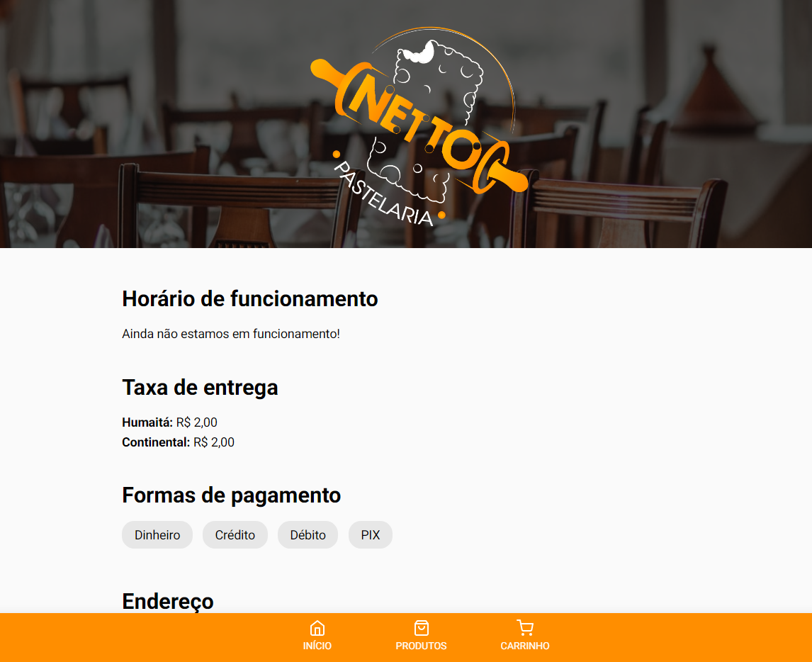
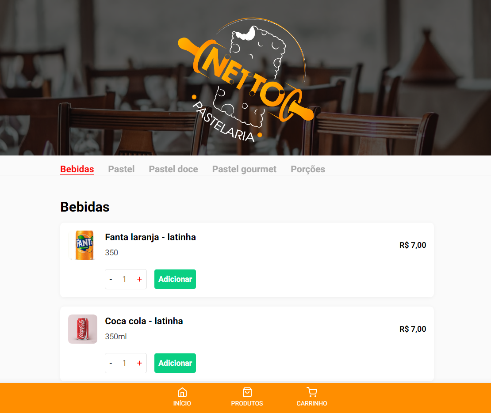
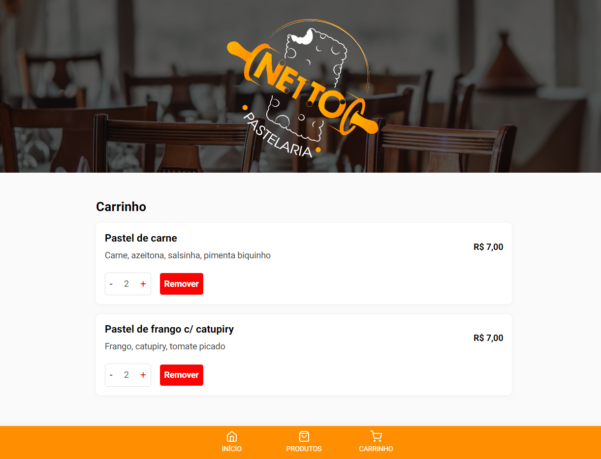

# Netto pastelaria
Aplicação para pastelaria utilizando Javascript e PHP (Wordpress).

## Features
- Informações sobre o estabelecimento
- CRUD de produtos
- Envio de informações de pedido para a API do Whatsapp

## Instalação e modo de uso
[Clique aqui para mais detalhes](https://github.com/rbmelolima/netto-pastelaria/wiki)

## Preview

Página inicial

  

Página de produtos

  

Página de carrinho

  

